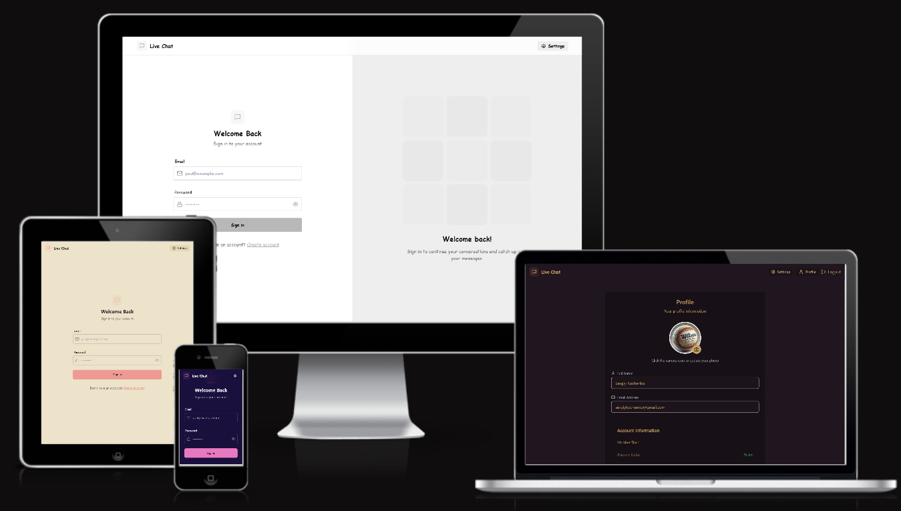

# Chat App

A real-time chat application allowing users to communicate instantly. Built using the MERN stack (MongoDB, Express, React, Node.js) and Socket.IO for real-time web socket communication.

[View Live Demo](https://real-time-go-chat-app.onrender.com/)  
[View Repository](https://github.com/SergiyKochenko/real-time-go-chat-app)

---

## Am I Responsive?



The application is fully responsive and works seamlessly across devices, including desktops, tablets, and mobile phones.

---

## Table of Contents

- [Chat App](#chat-app)
  - [Am I Responsive?](#am-i-responsive)
  - [Table of Contents](#table-of-contents)
  - [Project Goals](#project-goals)
  - [User Experience (UX)](#user-experience-ux)
    - [User Stories](#user-stories)
  - [Design](#design)
    - [Wireframes](#wireframes)
    - [Color Scheme](#color-scheme)
    - [Typography](#typography)
  - [Features](#features)
    - [Existing Features](#existing-features)
    - [Future Features](#future-features)
  - [Technologies Used](#technologies-used)
    - [Frontend](#frontend)
    - [Backend](#backend)
    - [API Endpoints](#api-endpoints)
      - [Message Routes](#message-routes)
  - [Testing](#testing)
    - [Manual Testing](#manual-testing)
    - [Validator Testing](#validator-testing)
    - [Performance Testing](#performance-testing)
    - [Known Bugs](#known-bugs)
  - [Deployment](#deployment)
    - [Preparation for Deployment](#preparation-for-deployment)
    - [Backend Deployment](#backend-deployment)
    - [Frontend Deployment](#frontend-deployment)
    - [Completed Deployment](#completed-deployment)
  - [Local Development](#local-development)
    - [Prerequisites](#prerequisites)
    - [Installation](#installation)
    - [Login and Signup Pages](#login-and-signup-pages)
    - [Profile Page](#profile-page)
    - [Settings Page](#settings-page)
    - [Sidebar](#sidebar)
    - [Chat Container](#chat-container)
    - [Bug Fix: `app.use("/api/messages", messageRoutes);`](#bug-fix-appuseapimessages-messageroutes)
    - [Notifications with `react-hot-toast`](#notifications-with-react-hot-toast)
    - [Implementation of Socket.io](#implementation-of-socketio)
      - [Backend Implementation](#backend-implementation)
      - [Frontend Implementation](#frontend-implementation)
      - [Key Features](#key-features)
      - [Example Code](#example-code)
  - [Running the Application](#running-the-application)
  - [Credits](#credits)
    - [Content](#content)
    - [Media](#media)
    - [Code](#code)
    - [Acknowledgements](#acknowledgements)
  - [License](#license)

---

## Project Goals

The goal of this project is to create a real-time chat application that allows users to communicate instantly. The application is designed to provide a seamless and secure user experience with features like user authentication, profile management, and real-time messaging.

---

## User Experience (UX)

### User Stories

* As a user, I want to register an account so that I can log in and use the chat.
* As a user, I want to log in with my email and password so that I can access my chat sessions.
* As a user, I want to update my profile picture so that I can personalize my account.
* As a user, I want to log out securely so that my account remains safe.
* *(Add more user stories as features are implemented.)*

---

## Design

### Wireframes

*(Include links or images of wireframes for key pages like Login, Signup, Chat Interface, etc.)*

### Color Scheme

*(Specify the color palette used in the application.)*

### Typography

*(Specify the fonts used for headings, body text, etc.)*

---

## Features

### Existing Features

* **User Authentication:** Secure signup, login, and logout functionality using JWT and cookies.
* **Profile Management:** Users can update their profile picture.
* **Real-time Messaging:** *(Add details once implemented.)*
* **Responsive Design:** *(Add details once implemented.)*

### Future Features

* Group chats.
* Online status indicators.
* Message notifications.
* Search functionality for users or messages.
* *(Add more planned features.)*

---

## Technologies Used

### Frontend

* React
* Vite
* Zustand (State Management)
* CSS (or specify framework like Tailwind CSS)

### Backend

* Node.js
* Express.js
* MongoDB (Database)
* Mongoose (ODM)
* JSON Web Tokens (JWT)
* bcryptjs
* cookie-parser
* dotenv
* Cloudinary (for image uploads)

### API Endpoints

#### Message Routes

- **GET `/api/message/users`**  
  Fetches a list of users (excluding the logged-in user) for the sidebar.  
  **Protected Route:** Requires authentication.

- **GET `/api/message/:id`**  
  Fetches messages between the logged-in user and the user with the specified `id`.  
  **Protected Route:** Requires authentication.

- **POST `/api/message/send/:id`**  
  Sends a message to the user with the specified `id`. Supports text and optional image uploads.  
  **Protected Route:** Requires authentication.

---

## Testing

### Manual Testing

*(Provide a table or list of manual tests performed.)*

| Feature          | Action                                 | Expected Result                     | Actual Result | Pass/Fail |
|-------------------|---------------------------------------|-------------------------------------|---------------|-----------|
| Signup           | Register with valid data              | User created and logged in          | *(Fill in)*   | *(Fill in)* |
| Login            | Login with valid credentials          | User logged in                      | *(Fill in)*   | *(Fill in)* |
| Logout           | Click logout button                   | User logged out                     | *(Fill in)*   | *(Fill in)* |
| Update Profile   | Upload a valid image                  | Profile picture updated             | *(Fill in)*   | *(Fill in)* |

### Validator Testing

* **HTML:** *(Link to W3C HTML validator results.)*
* **CSS:** *(Link to W3C CSS validator results.)*
* **JavaScript:** *(Describe linting setup and results.)*

### Performance Testing

* **Lighthouse:** *(Include Lighthouse scores for Performance, Accessibility, Best Practices, SEO.)*

### Known Bugs

* *(List any known bugs or issues.)*

---

## Deployment

### Preparation for Deployment

1. **Environment Variables**:
   Ensure the following environment variables are set in the `.env` file for both backend and frontend:
   - **Backend**:
     ```
     MONGO_URI=<your_mongodb_connection_string>
     JWT_SECRET=<your_jwt_secret>
     PORT=<desired_port_number>
     CLOUDINARY_CLOUD_NAME=<your_cloudinary_cloud_name>
     CLOUDINARY_API_KEY=<your_cloudinary_api_key>
     CLOUDINARY_API_SECRET=<your_cloudinary_api_secret>
     NODE_ENV=production
     ```
   - **Frontend**:
     ```
     VITE_API_BASE_URL=<backend_base_url>
     ```

2. **Build Frontend**:
   Navigate to the `frontend` directory and run:
   ```bash
   npm run build
   ```

3. **Serve Frontend with Backend**:
   Ensure the backend is configured to serve the frontend's `dist` folder in production mode:
   ```javascript
   if (process.env.NODE_ENV === "production") {
     app.use(express.static(path.join(__dirname, "/frontend/dist")));
     app.get("*", (req, res) => {
       res.sendFile(path.join(__dirname, "/frontend", "dist", "index.html"));
     });
   }
   ```

4. **Deploy to Hosting Platform**:
   - Deploy the backend (including the built frontend) to a hosting platform like Render, Heroku, or AWS.
   - Ensure the platform supports Node.js and MongoDB.

5. **Test Deployment**:
   - Verify that the application works as expected in the production environment.
   - Test all major features, including authentication, messaging, and real-time updates.

### Backend Deployment

*(Specify the platform used, e.g., Render, Heroku, and the steps involved.)*

### Frontend Deployment

*(Specify the platform used, e.g., Vercel, Netlify, and the steps involved.)*

### Completed Deployment

The application has been successfully deployed and is live at:  
**[https://real-time-go-chat-app.onrender.com/](https://real-time-go-chat-app.onrender.com/)**

The source code is available at:  
**[https://github.com/SergiyKochenko/real-time-go-chat-app](https://github.com/SergiyKochenko/real-time-go-chat-app)**

---

## Local Development

### Prerequisites

* Node.js and npm (or yarn) installed.
* MongoDB instance (local or cloud-based like MongoDB Atlas).
* Cloudinary account (for image uploads).

### Installation

1. Clone the repository:
    ```bash
    git clone <your-repository-url>
    cd chat-app
    ```

2. Backend Setup:
    ```bash
    cd backend
    npm install
    # Create a .env file in the backend directory with the following variables:
    # MONGO_URI=<your_mongodb_connection_string>
    # JWT_SECRET=<your_jwt_secret>
    # PORT=<desired_port_number>
    # CLOUDINARY_CLOUD_NAME=<your_cloudinary_cloud_name>
    # CLOUDINARY_API_KEY=<your_cloudinary_api_key>
    # CLOUDINARY_API_SECRET=<your_cloudinary_api_secret>
    ```

3. Frontend Setup:

1. Navigate to the `frontend` directory:
    ```bash
    cd frontend
    ```

2. Install dependencies:
    ```bash
    npm install react-router-dom react-hot-toast axios zustand lucide-react
    ```

3. Install and configure Tailwind CSS:
    ```bash
    npm install -D tailwindcss@3 postcss autoprefixer
    npx tailwindcss init -p
    ```

4. Install daisyUI:
    ```bash
    npm install -D daisyui@4.12.23
    ```

5. Start the development server:
    ```bash
    npm run dev
    ```

---

### Login and Signup Pages

The application includes fully functional Login and Signup pages with the following features:

- **Login Page**:
  - Users can log in using their email and password.
  - Password visibility toggle.
  - Error handling with `react-hot-toast` for invalid credentials.
  - Redirects to the home page upon successful login.

- **Signup Page**:
  - Users can create an account by providing their full name, email, and password.
  - Form validation with error messages displayed using `react-hot-toast`.
  - Redirects to the home page upon successful signup.

---

### Profile Page

The Profile Page allows users to view and update their profile information. Key features include:

- **Profile Picture Upload**:
  - Users can upload a new profile picture by clicking on the camera icon.
  - The image is displayed in real-time after upload.
  - A loading animation is shown while the image is being uploaded.

- **User Information**:
  - Displays the user's full name and email address.
  - Shows account details such as the account creation date and status.

- **Responsive Design**:
  - The page is fully responsive and works seamlessly on all devices.

---

### Settings Page

The Settings Page allows users to customize their chat experience by selecting a theme and previewing the changes in real-time. Key features include:

- **Theme Selection**:
  - Users can choose from a variety of themes to personalize the chat interface.
  - The selected theme is applied immediately and saved to `localStorage` for persistence across sessions.

- **Preview Section**:
  - Displays a mock chat interface to preview the selected theme.
  - If the user is logged in, their name and avatar are displayed in the preview. Otherwise, it defaults to "John Doe" and a placeholder avatar.

- **Responsive Design**:
  - The page is fully responsive and works seamlessly on all devices.

---

### Sidebar

The Sidebar component provides a list of users for the logged-in user to chat with. Key features include:

- **User List**:
  - Displays all users except the logged-in user.
  - Shows the user's profile picture, name, and online/offline status.

- **Online Status**:
  - Users who are online are indicated with a green dot on their profile picture.

- **Skeleton Loading**:
  - While the user data is being fetched, a skeleton loader is displayed to improve user experience.

- **User Selection**:
  - Clicking on a user selects them for a chat session, and the chat interface updates accordingly.

- **Responsive Design**:
  - The Sidebar is fully responsive and adapts to different screen sizes.

---

### Chat Container

The Chat Container is the main area where users can view and send messages in a chat session. Key features include:

- **Message Display**:
  - Displays all messages exchanged between the logged-in user and the selected user.
  - Messages are styled differently based on whether they are sent or received.
  - Includes support for text and image messages.

- **Message Timestamps**:
  - Each message displays a timestamp formatted using the `formatMessageTime` utility.

- **Message Input**:
  - Users can type and send text messages.
  - Users can also attach and send images along with their messages.
  - Includes a preview of the selected image with an option to remove it before sending.

- **Skeleton Loading**:
  - While messages are being fetched, a skeleton loader is displayed to improve user experience.

- **Scroll to Latest Message**:
  - Automatically scrolls to the latest message when new messages are added.

- **Responsive Design**:
  - The Chat Container is fully responsive and adapts to different screen sizes.

---

### Bug Fix: `app.use("/api/messages", messageRoutes);`

The `app.use("/api/messages", messageRoutes);` route in the backend was fixed to ensure proper functionality. The issue was related to the middleware or route handler not being correctly configured.

Steps taken to fix:
1. Verified that the `messageRoutes` file is correctly imported:
   ```javascript
   import messageRoutes from './routes/message.route.js';
   ```

2. Ensured the route is properly registered:
   ```javascript
   app.use("/api/messages", messageRoutes);
   ```

3. Restarted the backend server to apply the changes:
   ```bash
   npm run dev
   ```

---

### Notifications with `react-hot-toast`

The Profile Page uses [`react-hot-toast`](https://react-hot-toast.com/) to display notifications for profile updates:
- **Success Notification**: Shown when the profile is updated successfully.
- **Error Notification**: Shown if there is an issue during the update process.

Example usage:
```javascript
import toast from "react-hot-toast";

// Display a success message
toast.success("Profile updated successfully!");

// Display an error message
toast.error("Failed to update profile. Please try again.");
```

The Settings Page uses [`react-hot-toast`](https://react-hot-toast.com/) to display notifications for theme changes or other actions (if applicable).

Example usage:
```javascript
import toast from "react-hot-toast";

// Display a success message
toast.success("Theme updated successfully!");

// Display an error message
toast.error("Failed to update theme. Please try again.");
```

The Chat Container uses [`react-hot-toast`](https://react-hot-toast.com/) to display notifications for errors or actions (e.g., invalid file uploads).

Example usage:
```javascript
import toast from "react-hot-toast";

// Display an error message
toast.error("Failed to send message. Please try again.");

// Display a success message
toast.success("Message sent successfully!");
```

---

### Implementation of Socket.io

The application uses **Socket.io** to enable real-time communication between users. Below are the key aspects of the implementation:

#### Backend Implementation

- **Socket.io Server**:
  - The Socket.io server is initialized in the `socket.js` file.
  - It listens for client connections and manages online users using a `userSocketMap`.

- **Tracking Online Users**:
  - When a user connects, their `userId` and `socketId` are stored in the `userSocketMap`.
  - When a user disconnects, their entry is removed from the map.
  - The `getOnlineUsers` event is emitted to all connected clients whenever the list of online users changes.

- **Sending Messages**:
  - The `sendMessage` controller uses the `getReceiverSocketId` function to retrieve the receiver's `socketId`.
  - If the receiver is online, the message is sent to their socket in real-time using `io.to(receiverSocketId).emit()`.

#### Frontend Implementation

- **Socket Connection**:
  - The frontend establishes a WebSocket connection to the backend using the `socket.io-client` library.
  - The connection is initialized in the `useAuthStore` store when the user logs in or their authentication is verified.

- **Receiving Events**:
  - The `subscribeToMessages` function in the `useChatStore` listens for the `newMessage` event to update the chat in real-time.
  - The `getOnlineUsers` event updates the list of online users in the `Sidebar`.

#### Key Features

- **Real-Time Messaging**:
  - Messages are sent and received in real-time without requiring a page refresh.

- **Online Status**:
  - The `Sidebar` displays online users with a green dot on their profile picture.
  - The online user count is dynamically updated.

- **Scalable Architecture**:
  - The `userSocketMap` ensures efficient tracking of online users.
  - The architecture can be extended to support additional real-time features like typing indicators or read receipts.

#### Example Code

**Backend: Socket.io Setup**
```javascript
// filepath: c:\Users\Sergiy\Desktop\chat-app\backend\src\lib\socket.js
import { Server } from "socket.io";
import http from "http";
import express from "express";

const app = express();
const server = http.createServer(app);

const io = new Server(server, {
  cors: {
    origin: ["http://localhost:5173"],
  },
});

const userSocketMap = {}; // { userId: socketId }

io.on("connection", (socket) => {
  const userId = socket.handshake.query.userId;
  if (userId) userSocketMap[userId] = socket.id;

  io.emit("getOnlineUsers", Object.keys(userSocketMap));

  socket.on("disconnect", () => {
    delete userSocketMap[userId];
    io.emit("getOnlineUsers", Object.keys(userSocketMap));
  });
});

export { io, app, server };
```

**Frontend: Connecting to Socket.io**
```javascript
// filepath: c:\Users\Sergiy\Desktop\chat-app\frontend\src\store\useAuthStore.js
import { io } from "socket.io-client";

const BASE_URL = "http://localhost:5001";

export const useAuthStore = create((set, get) => ({
  socket: null,
  connectSocket: () => {
    const { authUser } = get();
    if (!authUser || get().socket?.connected) return;

    const socket = io(BASE_URL, {
      query: { userId: authUser._id },
    });
    socket.connect();

    set({ socket });

    socket.on("getOnlineUsers", (userIds) => {
      set({ onlineUsers: userIds });
    });
  },
  disconnectSocket: () => {
    if (get().socket?.connected) get().socket.disconnect();
  },
}));
```

---

## Running the Application

1. Start the Backend Server:
    ```bash
    cd backend
    npm run dev
    ```

2. Start the Frontend Development Server:
    ```bash
    cd ../frontend
    npm run dev
    ```

---

## Credits

### Content

* *(Acknowledge any tutorials, documentation, or other resources used.)*

### Media

* *(Acknowledge sources for images, icons, etc.)*

### Code

* *(Acknowledge any significant code snippets or libraries used.)*

### Acknowledgements

* *(Thank anyone who helped or inspired the project.)*

---

## License

*(Specify the license for your project, e.g., MIT License.)*
