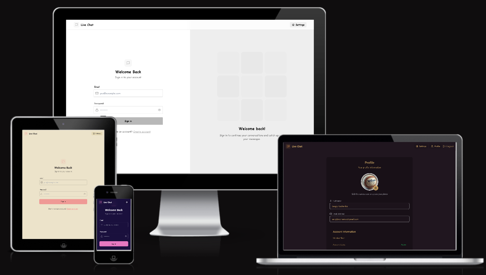
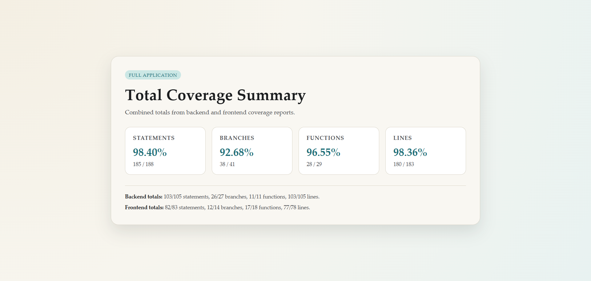
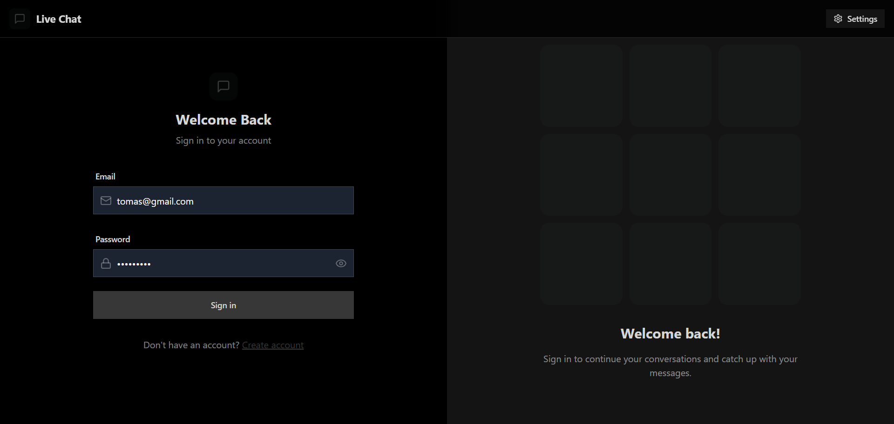
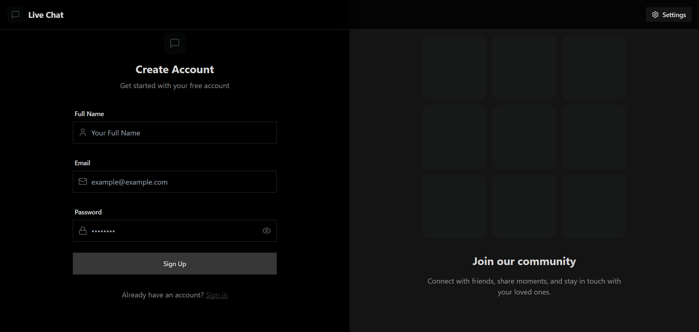
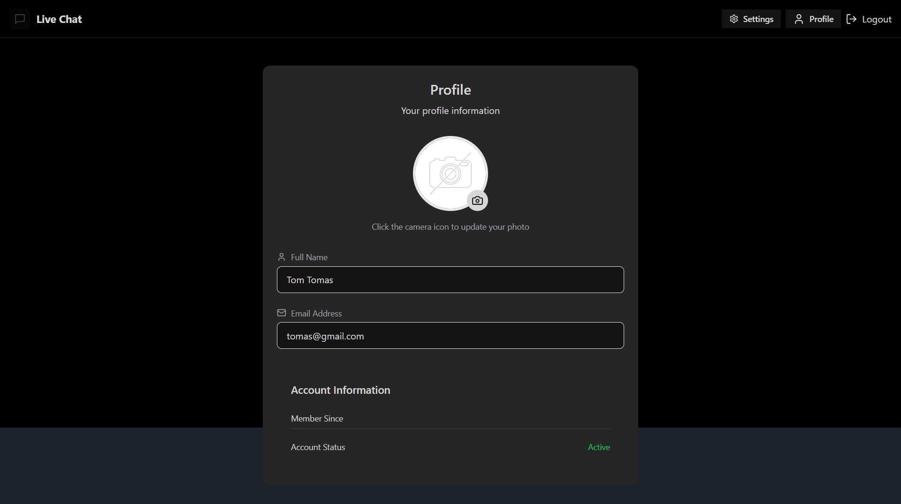
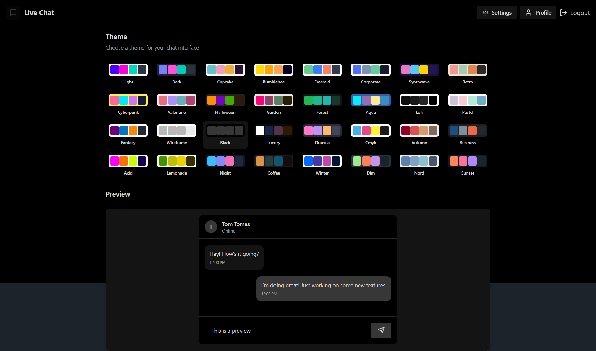
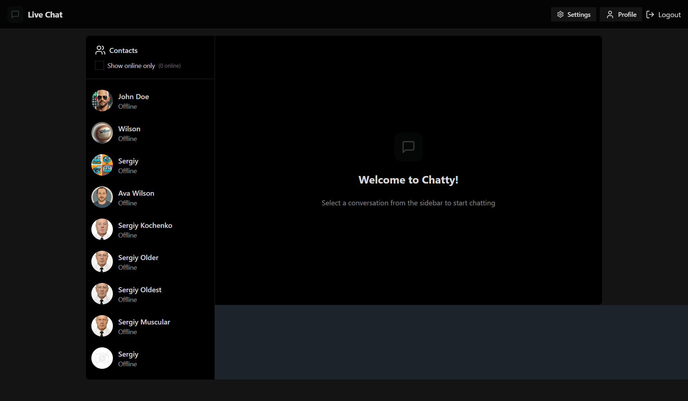
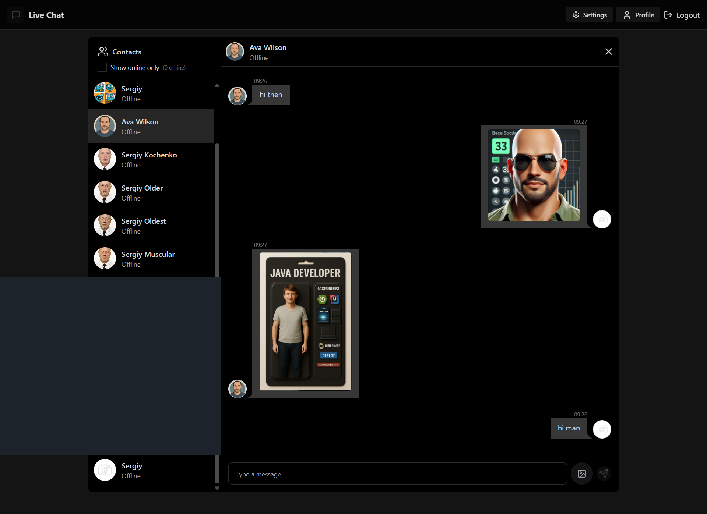

# Chat App

A real-time chat application allowing users to communicate instantly. Built using the MERN stack (MongoDB, Express, React, Node.js) and Socket.IO for real-time web socket communication.

[View Live Demo](https://real-time-go-chat-app.onrender.com/)  
[View Repository](https://github.com/SergiyKochenko/real-time-go-chat-app)

---

## Am I Responsive?



The application is fully responsive and works seamlessly across devices, including desktops, tablets, and mobile phones.

<details>
<summary>View Responsive Design Details</summary>

The chat application is tested and verified to work perfectly on:
- **Desktop:** Full layout with sidebar and chat container side-by-side
- **Tablet:** Optimized layout with responsive spacing
- **Mobile:** Mobile-first design with full-screen chat interface

</details>

---

## Table of Contents

- [Chat App](#chat-app)
  - [Am I Responsive?](#am-i-responsive)
  - [Table of Contents](#table-of-contents)
  - [Project Goals](#project-goals)
  - [User Experience (UX)](#user-experience-ux)
    - [User Stories](#user-stories)
  - [Design](#design)
    - [Wireframes](#wireframes)
    - [Color Scheme](#color-scheme)
    - [Typography](#typography)
  - [Features](#features)
    - [Existing Features](#existing-features)
    - [Future Features](#future-features)
  - [Technologies Used](#technologies-used)
    - [Frontend](#frontend)
    - [Backend](#backend)
    - [API Endpoints](#api-endpoints)
      - [Message Routes](#message-routes)
  - [Testing](#testing)
    - [Manual Testing](#manual-testing)
      - [Test Environment](#test-environment)
      - [Functional Test Matrix](#functional-test-matrix)
    - [Unit Test Coverage](#unit-test-coverage)
    - [Validator Testing](#validator-testing)
    - [Performance Testing](#performance-testing)
    - [Known Bugs](#known-bugs)
  - [Deployment](#deployment)
    - [Preparation for Deployment](#preparation-for-deployment)
    - [CI/CD Pipeline Jobs](#cicd-pipeline-jobs)
    - [Backend Deployment](#backend-deployment)
    - [Frontend Deployment](#frontend-deployment)
    - [Completed Deployment](#completed-deployment)
  - [Local Development](#local-development)
    - [Prerequisites](#prerequisites)
    - [Installation](#installation)
    - [Login and Signup Pages](#login-and-signup-pages)
    - [Profile Page](#profile-page)
    - [Settings Page](#settings-page)
    - [Sidebar](#sidebar)
    - [Chat Container](#chat-container)
    - [Bug Fix: `app.use("/api/messages", messageRoutes);`](#bug-fix-appuseapimessages-messageroutes)
    - [Notifications with `react-hot-toast`](#notifications-with-react-hot-toast)
    - [Implementation of Socket.io](#implementation-of-socketio)
      - [Backend Implementation](#backend-implementation)
      - [Frontend Implementation](#frontend-implementation)
      - [Key Features](#key-features)
      - [Example Code](#example-code)
  - [Running the Application](#running-the-application)
  - [Credits](#credits)
    - [Content](#content)
    - [Media](#media)
    - [Code](#code)
    - [Acknowledgements](#acknowledgements)
  - [License](#license)

---

## Project Goals

The goal of this project is to create a real-time chat application that allows users to communicate instantly. The application is designed to provide a seamless and secure user experience with features like user authentication, profile management, and real-time messaging.

---

## User Experience (UX)

### User Stories

* As a user, I want to register an account so that I can log in and use the chat.
* As a user, I want to log in with my email and password so that I can access my chat sessions.
* As a user, I want to update my profile picture so that I can personalize my account.
* As a user, I want to log out securely so that my account remains safe.
* *(Add more user stories as features are implemented.)*

---

## Design

### Wireframes

*(Include links or images of wireframes for key pages like Login, Signup, Chat Interface, etc.)*

### Color Scheme

*(Specify the color palette used in the application.)*

### Typography

*(Specify the fonts used for headings, body text, etc.)*

---

## Features

### Existing Features

1. **User-Friendly Interface:** Clean, intuitive design with a dark theme that ensures a seamless and enjoyable chatting experience across all devices.

2. **Secure Authentication:** Comprehensive user authentication with secure signup, login, and logout functionality using JWT tokens and HTTP-only cookies for maximum security.

3. **Real-Time Messaging:** Instant message delivery using Socket.IO for true real-time communication, allowing users to see messages appear instantly without page refresh.

4. **User Profiles:** Complete profile management system where users can update their profile picture, full name, and email address.

5. **Online Status Indicators:** Visual indicators displaying whether users are online or offline, helping users know when contacts are available.

6. **Message History:** Persistent message storage allowing users to retrieve and view their complete conversation history with any contact.

7. **Image Sharing:** Ability to attach and share images with messages, with support for image uploads via Cloudinary.

8. **Responsive Design:** Fully responsive layout that works seamlessly across desktops, tablets, and mobile devices with optimized UI for all screen sizes.

9. **Theme Customization:** Multiple theme options allowing users to personalize their chat interface with different color schemes and visual styles.

10. **Sidebar Navigation:** Organized contact list in the sidebar for easy navigation between conversations with a clean user interface.

### Future Features

* Group chats and group messaging.
* Message search functionality.
* Message reactions and emoji support.
* Voice and video calling capabilities.
* Message encryption for enhanced privacy.
* Message read receipts.
* User blocking and privacy settings.
* Chat notifications and sound alerts.
* Message pinning and favorites.
* User activity status and typing indicators.

---

## Technologies Used

### Frontend

* React
* Vite
* Zustand (State Management)
* CSS (or specify framework like Tailwind CSS)

### Backend

* Node.js
* Express.js
* MongoDB (Database)
* Mongoose (ODM)
* JSON Web Tokens (JWT)
* bcryptjs
* cookie-parser
* dotenv
* Cloudinary (for image uploads)

### API Endpoints

#### Message Routes

- **GET `/api/message/users`**  
  Fetches a list of users (excluding the logged-in user) for the sidebar.  
  **Protected Route:** Requires authentication.

- **GET `/api/message/:id`**  
  Fetches messages between the logged-in user and the user with the specified `id`.  
  **Protected Route:** Requires authentication.

- **POST `/api/message/send/:id`**  
  Sends a message to the user with the specified `id`. Supports text and optional image uploads.  
  **Protected Route:** Requires authentication.

---

## Testing

### Manual Testing

Manual testing was completed against both local and deployed environments, covering full user journeys and feature-level edge cases.

#### Test Environment

- OS: Windows 11
- Browsers: Chrome (latest), Edge (latest), Firefox (latest)
- Device simulation: Chrome DevTools (mobile and tablet presets)
- API/runtime: Node.js backend with MongoDB Atlas and Socket.IO
- Test targets:
  - Local development build
  - Production deployment: [https://real-time-go-chat-app.onrender.com](https://real-time-go-chat-app.onrender.com)

#### Functional Test Matrix

| Area | Test Scenario | Expected Result | Result |
|---|---|---|---|
| Authentication | Register with valid full name, email, and password | User account created, session cookie set, redirected to app | Pass |
| Authentication | Register with existing email | Error message shown, account not duplicated | Pass |
| Authentication | Register with empty required fields | Client-side or API validation error displayed | Pass |
| Authentication | Login with correct credentials | User redirected to home/chat and authenticated | Pass |
| Authentication | Login with incorrect password | Login denied and error toast/message displayed | Pass |
| Authentication | Refresh page while logged in | User session remains active | Pass |
| Authorization | Access protected route when logged out | Redirected to login page | Pass |
| Authorization | Use protected API without auth cookie | API rejects request with unauthorized response | Pass |
| Navigation | Switch between Home, Profile, and Settings | Navigation works without crashes | Pass |
| Navbar | Logout from navbar action | Session is cleared and user is redirected to login | Pass |
| Sidebar | User list loads after login | Sidebar shows available users excluding self | Pass |
| Sidebar | Select a user from sidebar | Active chat changes and message history loads | Pass |
| Chat | Send text-only message | Message appears immediately in sender thread | Pass |
| Chat | Receive real-time message in second session | Message appears without refresh via Socket.IO | Pass |
| Chat | Send image attachment with message | Uploaded image displays in message bubble | Pass |
| Chat | Attempt to send empty message | Message is blocked or ignored as invalid | Pass |
| Chat | Reload while in active conversation | Chat history reloads correctly from API | Pass |
| Chat UI | No conversation selected | Empty-state placeholder is shown | Pass |
| Chat UI | Slow network while loading messages/users | Skeleton/loading components are shown | Pass |
| Profile | Upload valid profile picture file | Avatar updates and persists after refresh | Pass |
| Profile | Upload unsupported/invalid file | Error shown and profile image unchanged | Pass |
| Settings | Change application theme | Theme switches immediately | Pass |
| Settings | Reload after theme change | Selected theme persists | Pass |
| Responsiveness | Mobile viewport test (375px width) | Layout remains usable and content readable | Pass |
| Responsiveness | Tablet viewport test (768px width) | Sidebar/chat/components remain aligned | Pass |
| Responsiveness | Desktop viewport test (>=1280px width) | Full chat layout renders correctly | Pass |

### Unit Test Coverage

The combined backend and frontend unit test coverage summary is captured below.



Coverage summary (combined): Statements 98.40%, Branches 92.68%, Functions 96.55%, Lines 98.36%.

### Validator Testing

* **HTML:** *(Link to W3C HTML validator results.)*
* **CSS:** *(Link to W3C CSS validator results.)*
* **JavaScript:** *(Describe linting setup and results.)*

### Performance Testing

* **Lighthouse:** *(Include Lighthouse scores for Performance, Accessibility, Best Practices, SEO.)*

### Known Bugs

* *(List any known bugs or issues.)*

---

## Deployment

### Preparation for Deployment

1. **Environment Variables**:
   Ensure the following environment variables are set in the `.env` file for both backend and frontend:
   - **Backend**:
     ```
     MONGO_URI=<your_mongodb_connection_string>
     JWT_SECRET=<your_jwt_secret>
     PORT=<desired_port_number>
     CLOUDINARY_CLOUD_NAME=<your_cloudinary_cloud_name>
     CLOUDINARY_API_KEY=<your_cloudinary_api_key>
     CLOUDINARY_API_SECRET=<your_cloudinary_api_secret>
     NODE_ENV=production
     ```
   - **Frontend**:
     ```
     VITE_API_BASE_URL=<backend_base_url>
     ```

2. **Build Frontend**:
   Navigate to the `frontend` directory and run:
   ```bash
   npm run build
   ```

3. **Serve Frontend with Backend**:
   Ensure the backend is configured to serve the frontend's `dist` folder in production mode:
   ```javascript
   if (process.env.NODE_ENV === "production") {
     app.use(express.static(path.join(__dirname, "/frontend/dist")));
     app.get("*", (req, res) => {
       res.sendFile(path.join(__dirname, "/frontend", "dist", "index.html"));
     });
   }
   ```

4. **Deploy to Hosting Platform**:
   - Deploy the backend (including the built frontend) to a hosting platform like Render, Heroku, or AWS.
   - Ensure the platform supports Node.js and MongoDB.

5. **Test Deployment**:
   - Verify that the application works as expected in the production environment.
   - Test all major features, including authentication, messaging, and real-time updates.

### CI/CD Pipeline Jobs

This project uses GitHub Actions workflow [`.github/workflows/cicd.yml`](.github/workflows/cicd.yml) with the following job flow:

1. **Build**
  - Installs backend and frontend dependencies.
  - Runs available test commands.
  - Builds the frontend.

2. **Deploy to Development**
  - Runs after Build.
  - Creates backend `.env` file from GitHub secrets.
  - Deploys with Docker Compose.

3. **Deploy to Staging**
  - Runs after Build (on `main`).
  - Creates backend `.env` file from staging secrets.
  - Deploys with Docker Compose.

4. **Deploy to Production**
  - Runs after Staging succeeds.
  - Uses GitHub Environment `production` with URL:
    [https://real-time-go-chat-app.onrender.com](https://real-time-go-chat-app.onrender.com)
  - Deploys with Docker Compose.

### Backend Deployment

*(Specify the platform used, e.g., Render, Heroku, and the steps involved.)*

### Frontend Deployment

*(Specify the platform used, e.g., Vercel, Netlify, and the steps involved.)*

### Completed Deployment

The application has been successfully deployed and is live at:  
**[https://real-time-go-chat-app.onrender.com/](https://real-time-go-chat-app.onrender.com/)**

The source code is available at:  
**[https://github.com/SergiyKochenko/real-time-go-chat-app](https://github.com/SergiyKochenko/real-time-go-chat-app)**

---

## Local Development

### Prerequisites

* Node.js and npm (or yarn) installed.
* MongoDB instance (local or cloud-based like MongoDB Atlas).
* Cloudinary account (for image uploads).

### Installation

1. Clone the repository:
    ```bash
    git clone <your-repository-url>
    cd chat-app
    ```

2. Backend Setup:
    ```bash
    cd backend
    npm install
    # Create a .env file in the backend directory with the following variables:
    # MONGO_URI=<your_mongodb_connection_string>
    # JWT_SECRET=<your_jwt_secret>
    # PORT=<desired_port_number>
    # CLOUDINARY_CLOUD_NAME=<your_cloudinary_cloud_name>
    # CLOUDINARY_API_KEY=<your_cloudinary_api_key>
    # CLOUDINARY_API_SECRET=<your_cloudinary_api_secret>
    ```

3. Frontend Setup:

1. Navigate to the `frontend` directory:
    ```bash
    cd frontend
    ```

2. Install dependencies:
    ```bash
    npm install react-router-dom react-hot-toast axios zustand lucide-react
    ```

3. Install and configure Tailwind CSS:
    ```bash
    npm install -D tailwindcss@3 postcss autoprefixer
    npx tailwindcss init -p
    ```

4. Install daisyUI:
    ```bash
    npm install -D daisyui@4.12.23
    ```

5. Start the development server:
    ```bash
    npm run dev
    ```

---

### Login and Signup Pages

The application includes fully functional Login and Signup pages providing a secure gateway to the chat platform.

**Login Page** - "Welcome Back":
- **Email and Password Input:** Users enter their credentials with validation to ensure correct format.
- **Password Visibility Toggle:** Icon to show/hide password for better user control.
- **Secure Authentication:** Uses JWT tokens stored in HTTP-only cookies for maximum security.
- **Error Handling:** Clear error messages displayed via `react-hot-toast` for invalid credentials or network issues.
- **Account Creation Link:** Quick access to the signup page for new users.
- **Responsive Design:** Works seamlessly on desktop, tablet, and mobile devices.
- **Auto-redirect:** Upon successful login, users are automatically redirected to the main chat interface.

<details>
<summary>Login Page Screenshot</summary>



</details>

**Signup Page** - "Join our Community":
- **Full Name Input:** Users provide their complete name for profile identification.
- **Email Registration:** Email validation ensures unique accounts and valid email formats.
- **Secure Password Creation:** Password field with visibility toggle and strength indication.
- **Form Validation:** Real-time validation with helpful error messages using `react-hot-toast`.
- **Account Confirmation:** Link to login page for users who already have an account.
- **Auto-redirect:** Upon successful signup, users are logged in and redirected to the chat interface.
- **Responsive Layout:** Optimized for all screen sizes with clean, intuitive UI.

<details>
<summary>Signup Page Screenshot</summary>



</details>

---

### Profile Page

The Profile Page provides a comprehensive user profile management interface allowing users to view and customize their account information.

Key Features:

- **Profile Picture Management**:
  - Upload or change profile picture by clicking the camera icon.
  - Real-time image preview after upload.
  - Loading animation displays during the upload process.
  - Cloudinary integration ensures secure and reliable image storage.

- **User Information Display**:
  - Full name display with option to view/edit.
  - Email address showing account's contact information.
  - Account creation date and membership timeline.
  - Current account status indicator (Active/Inactive).
  - Unique user identification.

- **Profile Enhancement**:
  - Edit button for updating personal information.
  - Save functionality for persisting profile changes.
  - Visual feedback for successful updates via toast notifications.

- **Security & Privacy**:
  - Password change option for account security.
  - Profile information accessible only to the logged-in user.
  - Secure image uploads with validation.

- **Responsive Design**:
  - Mobile-optimized profile card layout.
  - Tablet and desktop layouts with expanded information display.
  - Touch-friendly buttons and controls on all devices.

<details>
<summary>Profile Page Screenshot</summary>



</details>

---

### Settings Page

The Settings Page enables users to personalize their chat experience with comprehensive theme customization options and real-time preview functionality.

Key Features:

- **Theme Selection**:
  - **Multiple Theme Options**: Choose from 32 unique themes including Light, Dark, Cupcake, Bumblebee, Emerald, Corporate, Synthwave, Retro, Cyberpunk, Valentine, Halloween, Garden, Forest, Aqua, Lofi, Pastel, Wireframe, Black, Luxury, Dracula, Cmyk, Autumn, Business, Acid, Lemonade, Night, Coffee, Winter, Dim, Nord, and Sunset.
  - **Instant Application**: Selected theme is applied immediately without page refresh.
  - **Persistent Storage**: Theme preference is saved to `localStorage` and restored on next login.
  - **Visual Theme Grid**: Easy-to-scan display of all available color schemes with preview squares.

- **Real-Time Preview Section**:
  - **Mock Chat Interface**: Displays a sample chat conversation showing how messages will look with the selected theme.
  - **User Avatar Display**: Shows the logged-in user's profile picture and name in the preview (or placeholder for anonymous users).
  - **Theme Testing**: Preview actual message styling, colors, and contrast before committing to a theme.
  - **Sample Conversation**: Realistic chat bubbles demonstrating sender and receiver message formatting.

- **Accessibility**:
  - Clear theme names and visual indicators.
  - High contrast options for users with visual accessibility needs.
  - Easy switching between themes without losing settings.

- **Responsive Design**:
  - Theme grid adapts to mobile, tablet, and desktop layouts.
  - Preview section maintains readability across all screen sizes.
  - Touch-friendly theme selection buttons on mobile devices.

<details>
<summary>Settings Page Screenshot</summary>



</details>

---

### Sidebar

The Sidebar component provides the primary navigation interface for managing conversations and accessing available contacts.

Key Features:

- **User List & Contact Management**:
  - **Complete User Directory**: Displays all registered users except the currently logged-in user.
  - **User Avatars**: High-quality profile pictures for quick visual identification.
  - **User Names**: Clear display of contact names for easy browsing.
  - **Online/Offline Status**: Visual indicator (green dot) showing real-time presence status of each user.
  - **Active Conversation Highlight**: Selected user is highlighted to show the current active chat.

- **Presence Indicators**:
  - **Green Status Dot**: Indicates users who are currently online and available for chat.
  - **Offline Status**: Grayed out users who are not currently connected.
  - **Real-Time Updates**: Status updates instantly via Socket.IO when users login/logout.

- **Loading State**:
  - **Skeleton Loaders**: Animated placeholder components display while fetching user list from server.
  - **Improved UX**: Users see visual feedback instead of blank space during data loading.
  - **Performance**: Skeleton animations smooth out the loading experience.

- **User Interaction**:
  - **Click to Select**: Clicking a user opens their chat conversation in the main chat area.
  - **Instant Chat Switch**: Seamless transition between different conversations.
  - **Conversation History**: Automatically loads message history for selected user.

- **Search & Filter** *(Optional)*:
  - Quick search functionality to find specific contacts.
  - Filter by online status or recently messaged users.

- **Responsive Design**:
  - **Desktop**: Full sidebar visible with detailed user information.
  - **Tablet**: Optimized sidebar with condensed layout.
  - **Mobile**: Collapsible sidebar or swipeable drawer for better screen space utilization.

<details>
<summary>Home Page / Chat Interface Screenshot</summary>



</details>

---

### Chat Container

The Chat Container is the central messaging interface where users view conversations and exchange messages with selected contacts in real-time.

Key Features:

- **Message Display & Formatting**:
  - **Conversation History**: Displays all messages between the logged-in user and the selected contact.
  - **Message Differentiation**: Sent messages and received messages styled differently for clarity (user vs. contact).
  - **Rich Message Content**: Supports both text messages and image attachments.
  - **Message Organization**: Messages grouped chronologically with clear separation.
  - **Formatted Timestamps**: Each message includes a formatted timestamp showing when it was sent using the `formatMessageTime` utility.

- **Text Messaging**:
  - **Message Input Field**: Clean text input area for composing new messages.
  - **Send Functionality**: Button to send messages or keyboard shortcut (Enter key).
  - **Message Validation**: Prevents sending empty messages.
  - **Real-Time Delivery**: Messages appear instantly in the conversation via Socket.IO.

- **Image Sharing**:
  - **Image Attachment**: Users can attach images to messages using file upload button.
  - **Image Preview**: Preview of selected image before sending with option to remove/change.
  - **Cloudinary Integration**: Images securely uploaded and stored in Cloudinary.
  - **Image Display**: Attached images display inline in message bubbles.
  - **Multiple Formats**: Supports common image formats (JPG, PNG, GIF, WebP).

- **Loading & Performance**:
  - **Skeleton Loaders**: Animated placeholders while fetching message history.
  - **Lazy Loading**: Messages load efficiently without impacting performance.
  - **Loading Indicators**: Visual feedback during message send operations.

- **Scroll Behavior**:
  - **Auto-Scroll**: Automatically scrolls to the latest message when new messages arrive.
  - **Bottom Detection**: Maintains scroll position at latest messages for better UX.
  - **Smooth Scrolling**: Animated scroll transitions for a polished feel.

- **Empty State**:
  - **Welcome Message**: Displays "Welcome to Chatty!" when no conversation is selected.
  - **Selection Prompt**: Instructs users to "Select a conversation from the sidebar to start chatting".
  - **Clear Visual Hierarchy**: Distinguishes empty state from active conversations.

- **Responsive Design**:
  - **Desktop Layout**: Full message display with spacious layout.
  - **Tablet Layout**: Optimized message bubbles and input area.
  - **Mobile Layout**: Full-screen chat interface with adapted input controls.
  - **Touch Optimization**: Larger tap targets and optimized spacing for mobile users.

<details>
<summary>Chat Container / Message Editor Screenshot</summary>



</details>

---

### Bug Fix: `app.use("/api/messages", messageRoutes);`

The `app.use("/api/messages", messageRoutes);` route in the backend was fixed to ensure proper functionality. The issue was related to the middleware or route handler not being correctly configured.

Steps taken to fix:
1. Verified that the `messageRoutes` file is correctly imported:
   ```javascript
   import messageRoutes from './routes/message.route.js';
   ```

2. Ensured the route is properly registered:
   ```javascript
   app.use("/api/messages", messageRoutes);
   ```

3. Restarted the backend server to apply the changes:
   ```bash
   npm run dev
   ```

---

### Notifications with `react-hot-toast`

The Profile Page uses [`react-hot-toast`](https://react-hot-toast.com/) to display notifications for profile updates:
- **Success Notification**: Shown when the profile is updated successfully.
- **Error Notification**: Shown if there is an issue during the update process.

Example usage:
```javascript
import toast from "react-hot-toast";

// Display a success message
toast.success("Profile updated successfully!");

// Display an error message
toast.error("Failed to update profile. Please try again.");
```

The Settings Page uses [`react-hot-toast`](https://react-hot-toast.com/) to display notifications for theme changes or other actions (if applicable).

Example usage:
```javascript
import toast from "react-hot-toast";

// Display a success message
toast.success("Theme updated successfully!");

// Display an error message
toast.error("Failed to update theme. Please try again.");
```

The Chat Container uses [`react-hot-toast`](https://react-hot-toast.com/) to display notifications for errors or actions (e.g., invalid file uploads).

Example usage:
```javascript
import toast from "react-hot-toast";

// Display an error message
toast.error("Failed to send message. Please try again.");

// Display a success message
toast.success("Message sent successfully!");
```

---

### Implementation of Socket.io

The application uses **Socket.io** to enable real-time communication between users. Below are the key aspects of the implementation:

#### Backend Implementation

- **Socket.io Server**:
  - The Socket.io server is initialized in the `socket.js` file.
  - It listens for client connections and manages online users using a `userSocketMap`.

- **Tracking Online Users**:
  - When a user connects, their `userId` and `socketId` are stored in the `userSocketMap`.
  - When a user disconnects, their entry is removed from the map.
  - The `getOnlineUsers` event is emitted to all connected clients whenever the list of online users changes.

- **Sending Messages**:
  - The `sendMessage` controller uses the `getReceiverSocketId` function to retrieve the receiver's `socketId`.
  - If the receiver is online, the message is sent to their socket in real-time using `io.to(receiverSocketId).emit()`.

#### Frontend Implementation

- **Socket Connection**:
  - The frontend establishes a WebSocket connection to the backend using the `socket.io-client` library.
  - The connection is initialized in the `useAuthStore` store when the user logs in or their authentication is verified.

- **Receiving Events**:
  - The `subscribeToMessages` function in the `useChatStore` listens for the `newMessage` event to update the chat in real-time.
  - The `getOnlineUsers` event updates the list of online users in the `Sidebar`.

#### Key Features

- **Real-Time Messaging**:
  - Messages are sent and received in real-time without requiring a page refresh.

- **Online Status**:
  - The `Sidebar` displays online users with a green dot on their profile picture.
  - The online user count is dynamically updated.

- **Scalable Architecture**:
  - The `userSocketMap` ensures efficient tracking of online users.
  - The architecture can be extended to support additional real-time features like typing indicators or read receipts.

#### Example Code

**Backend: Socket.io Setup**
```javascript
// filepath: c:\Users\Sergiy\Desktop\chat-app\backend\src\lib\socket.js
import { Server } from "socket.io";
import http from "http";
import express from "express";

const app = express();
const server = http.createServer(app);

const io = new Server(server, {
  cors: {
    origin: ["http://localhost:5173"],
  },
});

const userSocketMap = {}; // { userId: socketId }

io.on("connection", (socket) => {
  const userId = socket.handshake.query.userId;
  if (userId) userSocketMap[userId] = socket.id;

  io.emit("getOnlineUsers", Object.keys(userSocketMap));

  socket.on("disconnect", () => {
    delete userSocketMap[userId];
    io.emit("getOnlineUsers", Object.keys(userSocketMap));
  });
});

export { io, app, server };
```

**Frontend: Connecting to Socket.io**
```javascript
// filepath: c:\Users\Sergiy\Desktop\chat-app\frontend\src\store\useAuthStore.js
import { io } from "socket.io-client";

const BASE_URL = "http://localhost:5001";

export const useAuthStore = create((set, get) => ({
  socket: null,
  connectSocket: () => {
    const { authUser } = get();
    if (!authUser || get().socket?.connected) return;

    const socket = io(BASE_URL, {
      query: { userId: authUser._id },
    });
    socket.connect();

    set({ socket });

    socket.on("getOnlineUsers", (userIds) => {
      set({ onlineUsers: userIds });
    });
  },
  disconnectSocket: () => {
    if (get().socket?.connected) get().socket.disconnect();
  },
}));
```

---

## Running the Application

1. Start the Backend Server:
    ```bash
    cd backend
    npm run dev
    ```

2. Start the Frontend Development Server:
    ```bash
    cd ../frontend
    npm run dev
    ```

---

## Credits

### Content

* *(Acknowledge any tutorials, documentation, or other resources used.)*

### Media

* *(Acknowledge sources for images, icons, etc.)*

### Code

* *(Acknowledge any significant code snippets or libraries used.)*

### Acknowledgements

* *(Thank anyone who helped or inspired the project.)*

---

## License

*(Specify the license for your project, e.g., MIT License.)*
