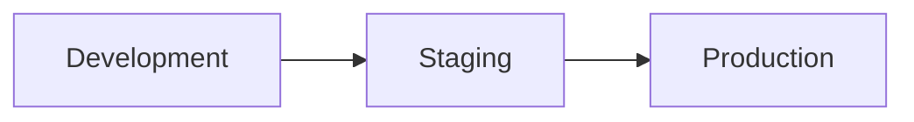
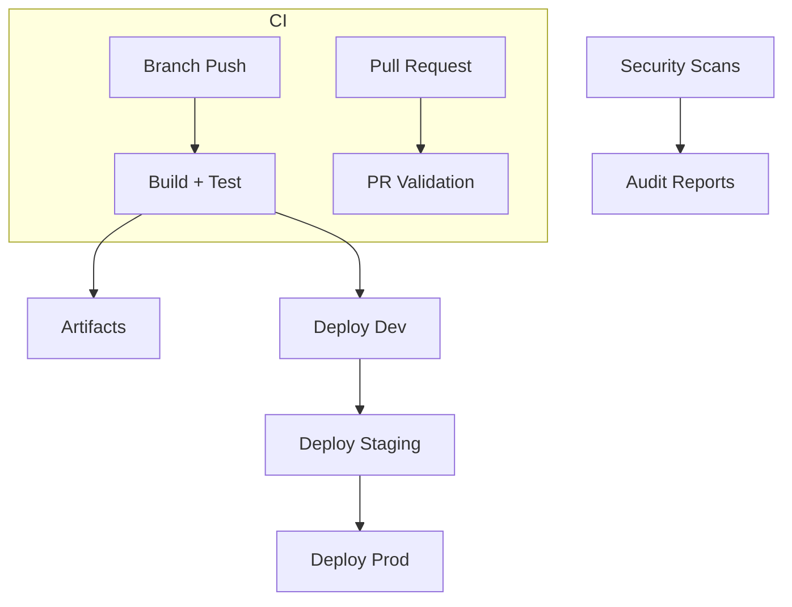
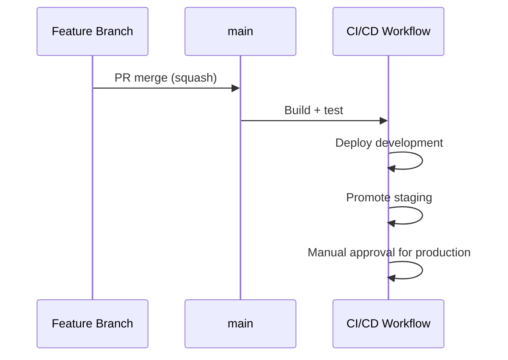

# DevOps Pipelines

Student: Sergiy Kochenko  
Student number: L00186189  
GitHub repository link: https://github.com/SergiyKochenko/real-time-go-chat-app  
Document date: 5 May 2026

## Table of Contents

- List of figures ................................ ii
- List of tables ................................. iii
- 1. Aims and objectives .......................... 1
- 2. Methodology .................................. 2
- 3. Results and evaluation ....................... 4
- 4. Conclusions and recommendations .............. 6
- References ...................................... 7

*Page numbers reflect PDF export with explicit page breaks.*

\pagebreak

## List of figures

- Figure 1: Pipeline environments overview ........ 2
- Figure 2: CI/CD architecture overview ........... 3
- Figure 3: Promotion and release flow ............ 3

## List of tables

- Table 1: Workflow inventory and triggers ........ 2
- Table 2: Quality gates by stage ................. 3
- Table 3: Environment controls and approvals ..... 3

\pagebreak

## 1. Aims and objectives

### Aim

Design, implement, and evaluate a GitHub Actions pipeline ecosystem that delivers reliable, secure, and auditable software releases across development, staging, and production environments.

### Objectives

1. Establish CI quality gates on every branch push and pull request.
2. Integrate DevSecOps scanning (secrets, SAST, dependency audits).
3. Provide controlled promotion across environments with health checks.
4. Improve repository governance with templates and automation.
5. Export DORA-aligned metrics snapshots for measurement.

## 2. Methodology

### 2.1 Pipeline architecture approach

The implementation separates responsibilities into dedicated workflows:

- **CI + CD Pipeline** (push to any branch): builds, tests, uploads artifacts, and deploys only from `main`.
- **PR Validation** (pull requests): fast lint/build/secret checks before merge.
- **DevSecOps Security Scans** (push + schedule): CodeQL and dependency audits.
- **GitOps Multi-Environment Deploy** (manual or automatic): promotion workflow with artifacts and health checks.
- **Repo Automation** (events): auto-labeling and optional project-board updates.
- **DORA Metrics Snapshot** (scheduled): exports workflow telemetry for metric analysis.

Marketplace actions are used to demonstrate automation maturity, including Gitleaks, Labeler, Add-to-Project, and Create-Issue-from-File.

Figure 1: Pipeline environments overview

Figure 2: CI/CD architecture overview

**Table 1: Workflow inventory and triggers**

| Workflow | Trigger | Purpose | Artifacts |
|---|---|---|---|
| CI + CD Pipeline | Push to any branch | Build, test, deploy from `main` | Coverage + build output |
| PR Validation | Pull request to `main` | Lint, build, secret scan | Frontend build |
| DevSecOps Security Scans | Push to `main`, weekly | SAST + dependency audit | Audit reports |
| GitOps Deploy | Push to `main`, manual | Promotion + health checks | Release package |
| Repo Automation | PR/issue events | Labels, project board | None |
| DORA Snapshot | Weekly/manual | Metrics export | JSON snapshot |

### 2.2 Branching and integration controls

The project follows **trunk-based development**:

- `main` is the only long-lived branch.
- Short-lived feature branches merge via PR using squash merge.
- **Feature flags** enable safe integration of incomplete work.
- Temporary `release/*` branches are used only for emergency stabilization.

### 2.3 CI and quality methodology

Quality gates are aligned to risk and speed:

- **Branch push gates:** backend tests with coverage, frontend tests with coverage, and builds.
- **PR gates:** frontend lint + build, backend syntax validation, secret scanning.
- **Main branch gates:** deployment plus smoke testing and incident escalation on failure.

**Table 2: Quality gates by stage**

| Stage | Gates | Purpose |
|---|---|---|
| Branch push | Tests + build | Fast feedback for authors |
| Pull request | Lint + build + secret scan | Pre-merge safety checks |
| Production | Deploy + smoke test | Release verification |

### 2.4 DevSecOps methodology

Security controls are embedded across the lifecycle:

- **Secret scanning:** Gitleaks on PRs.
- **SAST:** CodeQL on `main` and scheduled runs.
- **Dependency audits:** npm audit reports retained for review.

### 2.5 Release and artifact strategy

Artifacts are retained for traceability and rollback. Coverage, build outputs, and release bundles are stored as workflow artifacts with defined retention periods.

Figure 3: Promotion and release flow

**Table 3: Environment controls and approvals**

| Environment | Deployment trigger | Approval | Health check |
|---|---|---|---|
| Development | Auto from `main` | None | Optional |
| Staging | Auto after development | None | Optional |
| Production | After staging | Manual approval + smoke test | Required |

### 2.6 Notifications and governance

- Feature-branch CI failures create a GitHub issue assigned to the pusher.
- Smoke test failures on `main` create an incident issue for team visibility.
- Repository automation applies labels and optionally syncs items to a project board.

## 3. Results and evaluation

### 3.1 Implemented outcomes

- CI now runs on every branch push with consistent feedback.
- Deployments are restricted to `main` with environment gating.
- Security scanning is continuous and auditable.
- DORA snapshots provide structured data for measurement.

### 3.2 Evidence of effectiveness

- Test coverage is generated on every CI run and retained for review.
- Build artifacts are archived for auditing and rollback support.
- Deployment workflows generate health checks and summaries.

### 3.3 Critical evaluation

**Strengths:**

1. Clear separation of fast feedback (branch/PR) and high-governance checks (main).
2. Security scans run continuously without blocking development.
3. Governance automation reduces manual overhead in repository management.

**Limitations:**

1. End-to-end tests remain manual and are not yet automated in CI.
2. Deployment webhook configuration depends on environment secrets and must be maintained.
3. DORA metrics require analysis of the exported snapshots outside the workflow.

## 4. Conclusions and recommendations

### 4.1 Conclusions

The pipeline architecture delivers a practical, secure, and auditable CI/CD system aligned with CAMS and modern DevOps practices. The adoption of trunk-based development, automated quality gates, and structured metrics collection provides a stable foundation for continuous improvement.

### 4.2 Recommendations

1. Add automated end-to-end testing in staging (e.g., Playwright or Cypress).
2. Automate production rollback on failed smoke tests.
3. Extend DORA snapshot processing into a dashboard for trend analysis.
4. Introduce performance regression checks in the staging pipeline.

\pagebreak

## References

Atlassian (2024) *DevOps: Automation and Tooling*. Available at: https://www.atlassian.com/devops (Accessed: 5 May 2026).

DORA (Google Cloud) (2024) *DevOps Research and Assessment*. Available at: https://dora.dev (Accessed: 5 May 2026).

GitHub (2026) *GitHub Actions documentation*. Available at: https://docs.github.com/actions (Accessed: 5 May 2026).

Humble, J. and Farley, D. (2010) *Continuous Delivery: Reliable Software Releases through Build, Test, and Deployment Automation*. Addison-Wesley.

NIST (2022) *Secure Software Development Framework (SSDF)*. Available at: https://csrc.nist.gov/publications/detail/sp/800-218/final (Accessed: 5 May 2026).
