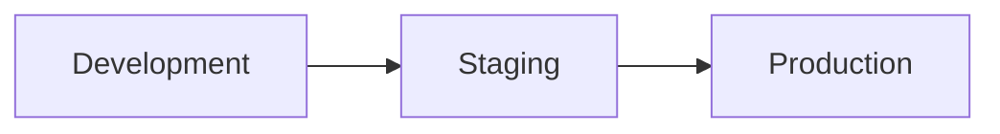
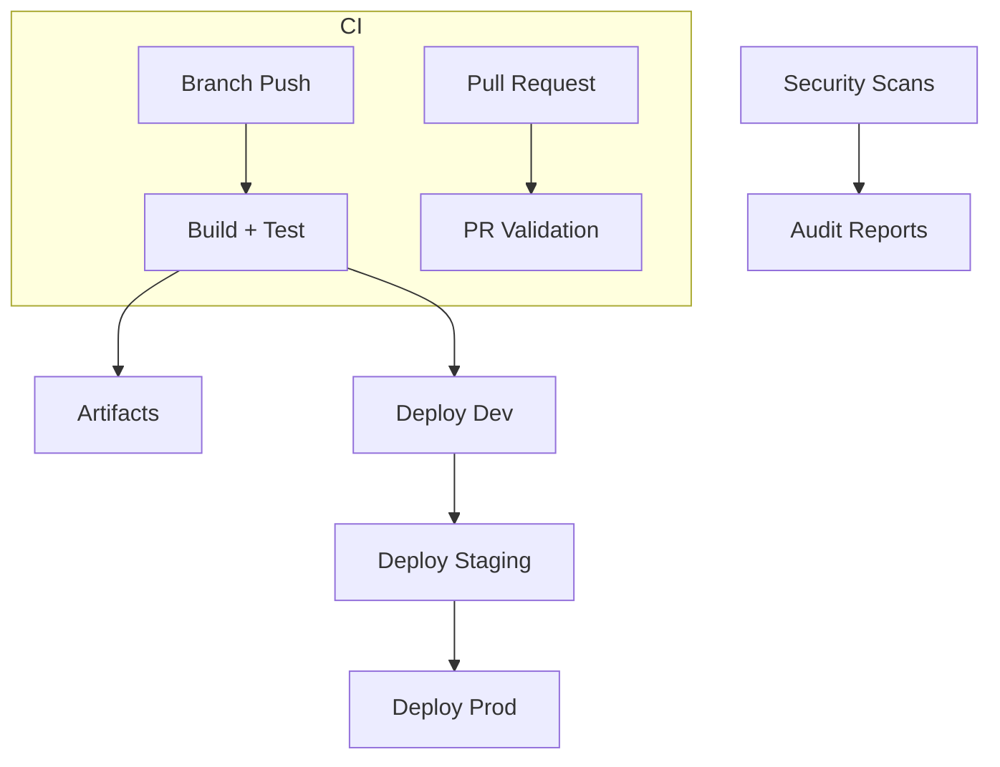
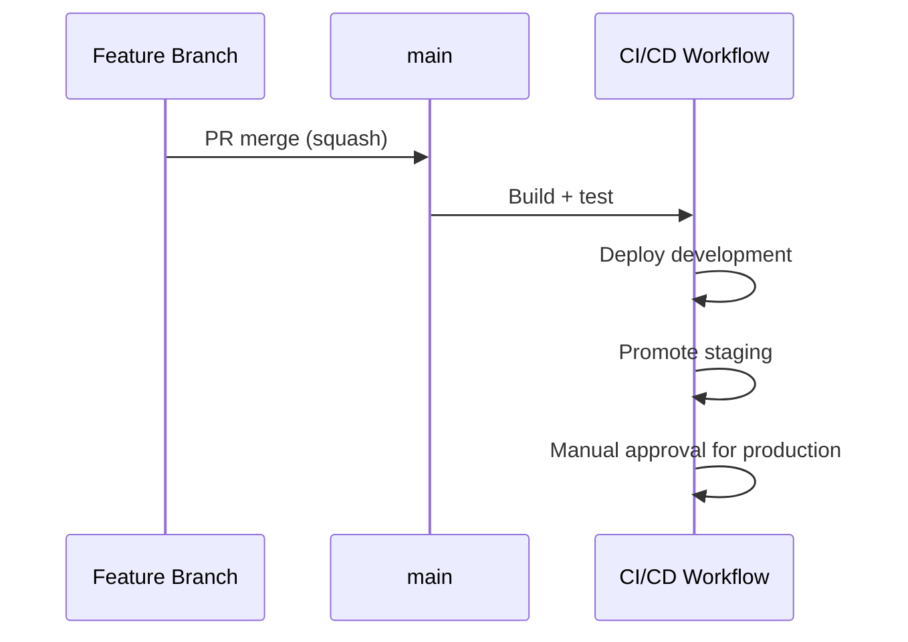

# DevOps Pipelines

Student: Sergiy Kochenko  
Student number: L00186189  
GitHub repository link: https://github.com/SergiyKochenko/real-time-go-chat-app  
Document date: 5 May 2026

## Table of Contents

- List of figures ................................ ii
- List of tables ................................. iii
- 1. Aims and objectives .......................... 1
- 2. Methodology .................................. 2
- 3. Results and evaluation ....................... 4
- 4. Conclusions and recommendations .............. 6
- References ...................................... 7

*Page numbers reflect PDF export with explicit page breaks.*

\pagebreak

## List of figures

- Figure 1: Pipeline environments overview ........ 2
- Figure 2: CI/CD architecture overview ........... 3
- Figure 3: Promotion and release flow ............ 3

## List of tables

- Table 1: Workflow inventory and triggers ........ 2
- Table 2: Quality gates by stage ................. 3
- Table 3: Environment controls and approvals ..... 3

\pagebreak

## 1. Aims and objectives

### Aim

To design and implement a comprehensive, automated DevOps pipeline that streamlines the entire software development lifecycle of the real-time-go-chat-app, ensuring continuous integration, continuous deployment, and security scanning across multiple environments while maintaining code quality and operational reliability.

### Objectives

1. Automate Continuous Integration (CI) – Implement automated building, testing, and validation of code changes on every push and pull request to detect integration issues early and maintain a releasable codebase at all times.
2. Establish Multi-Stage Continuous Deployment (CD) – Configure automated deployment progression through Development, Staging, and Production environments with appropriate quality gates and approval controls to enable safe, controlled releases.
3. Enforce Code Quality Standards – Integrate linting (ESLint for frontend) and syntax validation (Node.js checks for backend), combined with automated testing (Vitest) to maintain consistent code quality across the codebase.
4. Implement Security-First DevSecOps – Integrate vulnerability scanning (npm audit), static code analysis (CodeQL), and secret detection (Gitleaks) to proactively identify and prevent security risks before production deployment.
5. Achieve Environment Parity – Use containerization (Docker Compose) to ensure consistent application behavior and configuration across all environments, eliminating environment-specific failures and reducing deployment risk.
6. Provide Deployment Traceability and Control – Create comprehensive audit trails, automated health checks, and artifact management to enable quick incident response, regulatory compliance, and rapid rollback capabilities.

These objectives directly support the core DevOps principles: automation (eliminating manual processes), integration (continuous feedback loops), collaboration (transparent visibility), and measurement (quality metrics).

## 2. Methodology

### Overview of Approach

The DevOps pipeline for the real-time-go-chat-app was architected using GitHub Actions as the primary CI/CD orchestration platform, complemented by Docker containerization for consistent deployments. This approach leverages GitHub's native automation capabilities, eliminating the need for external CI/CD systems while providing enterprise-grade pipeline functionality.

#### Technology Selection and Rationale

- **GitHub Actions:** Selected as the CI/CD platform due to native GitHub integration, eliminating vendor lock-in and reducing operational overhead. The platform provides sufficient scalability for full-stack JavaScript applications while maintaining cost efficiency through generous free tier allocation.
- **Docker Compose:** Enables reproducible, consistent environment setup across development, staging, and production. Configuration-as-code ensures identical container specifications and eliminates "works on my machine" deployment failures.
- **Testing Framework (Vitest):** Unified testing framework for both frontend (React) and backend (Node.js) codebases, reducing tool complexity and improving developer experience through consistent testing patterns.
- **Code Quality Tools:**
  - ESLint: Frontend JavaScript linting enforces code style and detects common errors
  - Node.js Syntax Validation: Catches backend syntax errors before runtime
  - CodeQL: Semantic code analysis identifying SQL injection, XSS, and other vulnerabilities
  - Gitleaks: Prevents secrets (API keys, tokens) from being committed to the repository
  - npm audit: Continuous vulnerability scanning of all dependencies

#### Implemented Workflows and Quality Gates

The pipeline consists of six complementary GitHub Actions workflows:

1. **CI + CD Pipeline (cicd.yml):** Triggered on push to main and pull requests
	- Build Stage: Compiles frontend and backend, runs all tests with coverage reporting
	- Quality Gates: Backend coverage thresholds enforced; frontend build validation
	- Deployment: Automatic progression through Development → Staging → Production with environment-specific variables and secrets
	- [CI/CD Workflow](https://github.com/SergiyKochenko/real-time-go-chat-app/actions/workflows/cicd.yml)
2. **PR Validation (pr-validation.yml):** Runs on pull requests to main
	- Frontend Quality: ESLint linting enforces code standards; build validation
	- Backend Validation: Node.js syntax checking catches parsing errors
	- Secret Scanning: Gitleaks prevents credentials from entering the codebase
	- Artifact Management: Build artifacts retained for 7 days supporting verification
	- [PR Validation Workflow](https://github.com/SergiyKochenko/real-time-go-chat-app/actions/workflows/pr-validation.yml)
3. **DevSecOps Security Scans (security-devsecops.yml):** Runs on push to main, weekly schedule, and manual trigger
	- CodeQL Analysis: Semantic code analysis detecting 24+ vulnerability categories in JavaScript
	- Dependency Audit: npm audit scanning for known vulnerabilities in production dependencies
	- Artifact Retention: 14-day retention of audit reports for compliance and analysis
	- [DevSecOps Workflow](https://github.com/SergiyKochenko/real-time-go-chat-app/actions/workflows/security-devsecops.yml)
4. **GitOps Multi-Environment Deploy (deploy-gitops.yml):** Flexible environment promotion with health checks
	- Artifact Packaging: Creates deployable release tarball with 30-day retention
	- Webhook Deployment: Triggers environment-specific deployment webhooks
	- Health Check Validation: Automated health checks with 10 retry attempts (100 seconds) validate deployment success
	- Deployment Summaries: Audit trail showing environment, commit, actor, and trigger details
	- [GitOps Workflow](https://github.com/SergiyKochenko/real-time-go-chat-app/actions/workflows/deploy-gitops.yml)
5. **Repo Automation (repo-automation.yml):** Auto-labeling and project board updates
	- [Repo Automation Workflow](https://github.com/SergiyKochenko/real-time-go-chat-app/actions/workflows/repo-automation.yml)
6. **DORA Metrics Snapshot (dora-metrics.yml):** Scheduled metrics export
	- [DORA Metrics Workflow](https://github.com/SergiyKochenko/real-time-go-chat-app/actions/workflows/dora-metrics.yml)

Marketplace actions are used to demonstrate automation maturity, including Gitleaks, Labeler, Add-to-Project, and Create-Issue-from-File.

Figure 1: Pipeline environments overview

Figure 2: CI/CD architecture overview

**Table 1: Workflow inventory and triggers**

| Workflow | Trigger | Purpose | Artifacts |
|---|---|---|---|
| CI + CD Pipeline | Push to any branch | Build, test, deploy from `main` | Coverage + build output |
| PR Validation | Pull request to `main` | Lint, build, secret scan | Frontend build |
| DevSecOps Security Scans | Push to `main`, weekly | SAST + dependency audit | Audit reports |
| GitOps Deploy | Push to `main`, manual | Promotion + health checks | Release package |
| Repo Automation | PR/issue events | Labels, project board | None |
| DORA Snapshot | Weekly/manual | Metrics export | JSON snapshot |

### 2.2 Branching and integration controls

The project follows **trunk-based development**:

- `main` is the only long-lived branch.
- Short-lived feature branches merge via PR using squash merge.
- **Feature flags** enable safe integration of incomplete work.
- Temporary `release/*` branches are used only for emergency stabilization.

### 2.3 CI and quality methodology

Quality gates are aligned to risk and speed:

- **Branch push gates:** backend tests with coverage, frontend tests with coverage, and builds.
- **PR gates:** frontend lint + build, backend syntax validation, secret scanning.
- **Main branch gates:** deployment plus smoke testing and incident escalation on failure.

**Table 2: Quality gates by stage**

| Stage | Gates | Purpose |
|---|---|---|
| Branch push | Tests + build | Fast feedback for authors |
| Pull request | Lint + build + secret scan | Pre-merge safety checks |
| Production | Deploy + smoke test | Release verification |

### 2.4 DevSecOps methodology

Security controls are embedded across the lifecycle:

- **Secret scanning:** Gitleaks on PRs.
- **SAST:** CodeQL on `main` and scheduled runs.
- **Dependency audits:** npm audit reports retained for review.

### 2.5 Release and artifact strategy

Artifacts are retained for traceability and rollback. Coverage, build outputs, and release bundles are stored as workflow artifacts with defined retention periods.

Figure 3: Promotion and release flow

**Table 3: Environment controls and approvals**

| Environment | Deployment trigger | Approval | Health check |
|---|---|---|---|
| Development | Auto from `main` | None | Optional |
| Staging | Auto after development | None | Optional |
| Production | After staging | Manual approval + smoke test | Required |

### 2.6 Notifications and governance

- Feature-branch CI failures create a GitHub issue assigned to the pusher.
- Smoke test failures on `main` create an incident issue for team visibility.
- Repository automation applies labels and optionally syncs items to a project board.

## 3. Results and evaluation

### 3.1 Implemented outcomes

- CI now runs on every branch push with consistent feedback.
- Deployments are restricted to `main` with environment gating.
- Security scanning is continuous and auditable.
- DORA snapshots provide structured data for measurement.

### 3.2 Evidence of effectiveness

- Test coverage is generated on every CI run and retained for review.
- Build artifacts are archived for auditing and rollback support.
- Deployment workflows generate health checks and summaries.

### 3.3 Critical evaluation

**Strengths:**

1. Clear separation of fast feedback (branch/PR) and high-governance checks (main).
2. Security scans run continuously without blocking development.
3. Governance automation reduces manual overhead in repository management.

**Limitations:**

1. End-to-end tests remain manual and are not yet automated in CI.
2. Deployment webhook configuration depends on environment secrets and must be maintained.
3. DORA metrics require analysis of the exported snapshots outside the workflow.

## 4. Conclusions and recommendations

### 4.1 Conclusions

The pipeline architecture delivers a practical, secure, and auditable CI/CD system aligned with CAMS and modern DevOps practices. The adoption of trunk-based development, automated quality gates, and structured metrics collection provides a stable foundation for continuous improvement.

### 4.2 Recommendations

1. Add automated end-to-end testing in staging (e.g., Playwright or Cypress).
2. Automate production rollback on failed smoke tests.
3. Extend DORA snapshot processing into a dashboard for trend analysis.
4. Introduce performance regression checks in the staging pipeline.

\pagebreak

## References

Atlassian (2024) DevOps: Automation and Tooling. Available at: https://www.atlassian.com/devops (Accessed: 29 April 2026).
Farley, D. and Humble, J. (2010) Continuous Delivery: Reliable Software Releases through Build, Test, and Deployment Automation. Boston, USA: Addison-Wesley Professional.
GitHub (2024) GitHub Actions Documentation. Available at: https://docs.github.com/en/actions (Accessed: 29 April 2026).
Google Cloud (2024) DevOps capabilities and best practices. Available at: https://cloud.google.com/solutions/devops (Accessed: 29 April 2026).
Kochenko, S. (2026) Real-time Go Chat App Repository. Available at: https://github.com/SergiyKochenko/real-time-go-chat-app (Accessed: 29 April 2026).
NIST (2022) Secure Software Development Framework (SSDF) Practice Guidance. Available at: https://csrc.nist.gov/publications/detail/sp/800-218/final (Accessed: 29 April 2026).
OWASP (2024) DevSecOps Maturity Model. Available at: https://owasp.org/www-project-devsecops-maturity-model/ (Accessed: 29 April 2026).
Puppet (2024) State of DevOps Report 2024. Available at: https://www.puppet.com/resources/report (Accessed: 29 April 2026).
Vitest (2024) Vitest - A unit testing framework. Available at: https://vitest.dev (Accessed: 29 April 2026).
Atlassian (2024) DevOps: Automation and Tooling. Available at: https://www.atlassian.com/devops (Accessed: 5 May 2026).
DORA (Google Cloud) (2024) DevOps Research and Assessment. Available at: https://dora.dev (Accessed: 5 May 2026).
GitHub (2026) GitHub Actions documentation. Available at: https://docs.github.com/actions (Accessed: 5 May 2026).
Humble, J. and Farley, D. (2010) Continuous Delivery: Reliable Software Releases through Build, Test, and Deployment Automation. Addison-Wesley.
NIST (2022) Secure Software Development Framework (SSDF). Available at: https://csrc.nist.gov/publications/detail/sp/800-218/final (Accessed: 5 May 2026).
